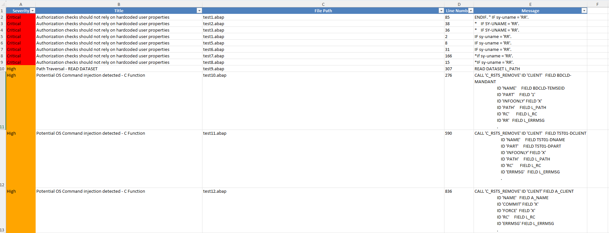

<div align="center">


# OWASP ABAP Code Scanner

**Static Application Security Testing (SAST) for SAP ABAP.**
A free, open-source CLI for finding security vulnerabilities in custom ABAP code - offline and in CI.

[](https://owasp.org/projects/)
[](LICENSE)
[](https://www.python.org/)
[](https://github.com/OWASP/abap-code-scanner/stargazers)
[](https://github.com/OWASP/abap-code-scanner/issues)

</div>

---

## Editions

| Edition | What it is | Where |
|---|---|---|
| **Open-source CLI** (free, MIT) | Scan exported ABAP source locally or in CI | This repo (below) |
| **Cloud (SAP BTP)** | Commercial SaaS that reads ABAP over BTP destinations | [Cloud / BTP edition](btp-edition.md) |
| **Web (Management Console)** | Commercial web SAST that connects to SAP via JCo / RFC | [Web edition](web-edition.md) |

The commercial editions are by [RedRays](https://redrays.io/); this OWASP project (the open-source CLI) is free and open source.

## Why

SAP runs on custom **ABAP** code - often millions of lines, written over decades, powering payroll, finance and logistics. That code is rarely security-reviewed and is a frequent source of injection, path-traversal and hard-coded-secret bugs, while standard SAP tooling is heavy and system-bound.

This CLI statically analyses **exported** ABAP source **offline** - no SAP connection, no agent, no telemetry - and writes an XLSX report you can act on. Drop it into CI to gate pull requests.

## Quick start

> Requires **Python 3.9+** and `pip`.

```bash
git clone https://github.com/OWASP/abap-code-scanner.git
cd abap-code-scanner
pip install -r requirements.txt

python main.py path/to/abap/source
```

When the scan finishes you will find **`abap_security_scan_report.xlsx`** in the project folder:

<div align="center">
  
</div>

### CLI options

| Option | Description | Default |
|---|---|---|
| `path` | Directory of ABAP source to scan | _(required)_ |
| `-c`, `--config` | Path to the YAML config file | `config.yml` |

## Configuration

The scanner reads a YAML file (default `config.yml`, override with `-c`). Pick the checks to run, the file extensions to include, and patterns to exclude:

```yaml
checks:
  - CheckCrossSiteScripting
  - CheckSQLInjection
  - CheckDirectoryTraversal

file_extensions:
  - .abap
  - .txt

exclude_patterns:
  - "**/test/**"
```

## Writing a custom check

1. Create a new Python file in the `checks/` directory.
2. Define a class that inherits from the base check class.
3. Implement the required methods, including the main `run` method.
4. Add the class name to the `checks:` list in your config file.

## Running the tests

```bash
# Unix-like
./run_tests.sh

# Windows
run_tests.bat
```

## Roadmap

- [ ] Data-flow / taint analysis (sources to sinks) to cut false positives
- [ ] SARIF output for GitHub code scanning
- [ ] JSON output
- [ ] More checks mapped to the OWASP Top 10 and SAP secure-coding guidance

## Contributing

Pull requests are welcome new checks, test cases, bug fixes and docs all help. See [CONTRIBUTING.md](CONTRIBUTING.md) and please follow the OWASP Code of Conduct.

## Security

Found a vulnerability in the scanner itself? Please follow the responsible-disclosure process in [SECURITY.md](SECURITY.md) - do **not** open a public issue for security reports.

## License

[MIT](LICENSE). Originally contributed and maintained by [RedRays](https://redrays.io/). The [Cloud (SAP BTP)](btp-edition.md) and [Web (Management Console)](web-edition.md) editions are commercial products; this OWASP project (the open-source CLI) is free and open source.

---

<div align="center"><sub>An <a href="https://owasp.org/">OWASP</a> Incubator Project.</sub></div>
