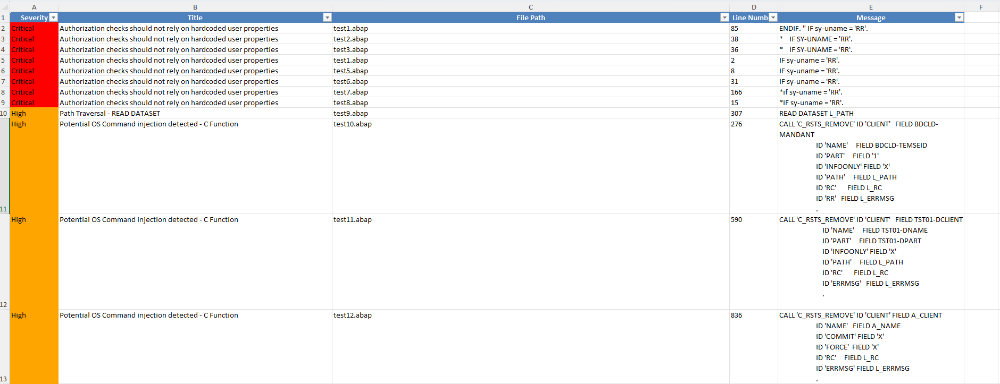

## Overview

The ABAP Code Scanner is a powerful tool designed to analyze ABAP (Advanced Business Application Programming) code for potential security vulnerabilities, code quality issues, and best practice violations. This provides a flexible and extensible way to scan ABAP code and generate comprehensive reports on various aspects of code security and quality.

---

**🌟🚀 New Generation Released!🚀🌟**

We are thrilled to announce the **next generation** of the **ABAP Code Scanner**, featuring enhanced capabilities and better performance for identifying security vulnerabilities, coding errors, and potential performance issues in your ABAP (Advanced Business Application Programming) code. This version is a major upgrade that provides deeper analysis and more accurate results. Get started now and elevate your code security with the latest improvements.

### For more details and to use the tool directly, visit the official [ABAP Code Scanner page](https://redrays.io/abap-scanner/).

---

## Features

- Multiple security checks including:
  - Cross-Site Scripting (XSS) vulnerabilities
  - Directory Traversal vulnerabilities
  - Hardcoded credentials
  - Weak cryptographic algorithms
  - And many more...
- Customizable and extensible architecture
- Command-line interface for easy integration into CI/CD pipelines
- Detailed reporting in XLSX format
- Configurable scan settings

## Upcoming Feature: Dataflow Analysis

We are excited mdto announce that we are working on implementing a dataflow analysis feature. This enhancement will significantly improve the accuracy and depth of our security scans.

### What is Dataflow Analysis?

Dataflow analysis is a technique used to track how data moves through an application. In the context of security, it helps identify how potentially tainted data (e.g., user inputs) propagates through the system and whether it reaches sensitive sinks (e.g., database queries, output functions) without proper sanitization.

### Planned Functionality

Our dataflow analysis will:

- Track parameters and their contents from the beginning of functions, reports, forms, includes, or other ABAP structures.
- Follow the data as it flows through the code, monitoring transformations and assignments.
- Identify potential injection points where tainted data might be used unsafely.
- Provide more accurate and context-aware vulnerability detection.

This feature will enable the to:
- Reduce false positives by understanding the context and transformations of data.
- Detect complex vulnerabilities that simple pattern matching might miss.
- Offer more detailed and actionable reports on potential security issues.

## Advanced Private Version

We are excited to announce that a more advanced version of the ABAP Code Scanner is available as private software. This enhanced version includes:

- Over 250 security checks for comprehensive code analysis
- Additional reporting formats and integration options
- Priority support and regular updates

For more information about the advanced private version, please contact RedRays, Inc. at support@redrays.io.

## Prerequisites

- Python 3.9 or higher
- pip (Python package installer)

## Installation

1. Clone the repository:
   ```
   git clone https://github.com/redrays-io/ABAP-Code-Scanner.git
   cd ABAP-Code-Scanner
   ```

2. Install the required dependencies:
   ```
   pip install -r requirements.txt
   ```

## Usage

To run the ABAP Code Scanner:

```
python main.py path/to/abap/code/dir
```

Optional arguments:
- `-c`, `--config`: Path to the configuration file (default: config.yml)

## Report
When the program finishes successfully, you will find the abap_security_scan_report.xlsx file in the project folder. 
Below, you can see an example of the report file.


## Configuration

The scanner can be configured using a YAML file. By default, it looks for `config.yml` in the project root. You can specify a different configuration file using the `-c` or `--config` option.

Example configuration:

```yaml
checks:
  - CheckCrossSiteScripting
  - CheckSQLInjection
  - CheckDirectoryTraversal

file_extensions:
  - .abap
  - .txt

exclude_patterns:
  - "**/test/**"
```

## Adding New Checks

To add a new security check:

1. Create a new Python file in the `checks` directory.
2. Define a class that inherits from a base check class.
3. Implement the required methods, including the main `run` method.
4. Add the new check to the configuration file.

## Running Tests

To run the test suite:

On Windows:
```
run_tests.bat
```

On Unix-like systems:
```
./run_tests.sh
```

## Contributing

Contributions to the ABAP Code Scanner are welcome! Please feel free to submit pull requests, create issues or spread the word.

## License

This project is licensed under the MIT License - see the [LICENSE](LICENSE) file for details.

## Acknowledgments

- Thanks to all contributors who have helped to improve this framework.
- Special thanks to the ABAP community for their invaluable resources and documentation.

